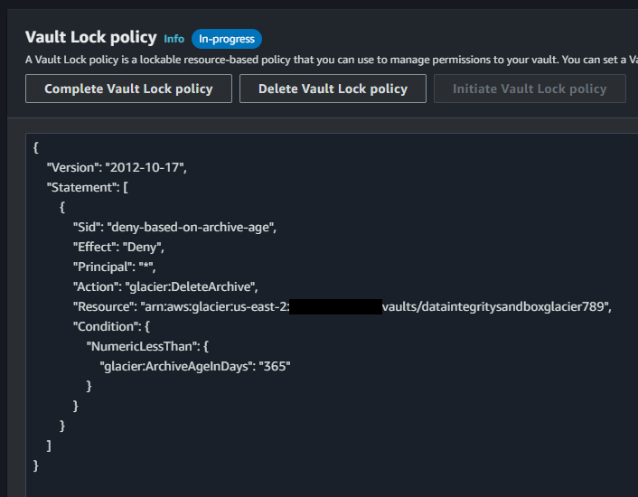

# AWS Data Integrity

Set of Data Integrity features provided by AWS services as a requirement for AWS Security.

The following services provide data integrity features:

- S3 Object Lock
- S3 Glacier Vault Lock
- AWS Backup Vault Lock

Additionally, Legal Hold is available for S3 and Backup Vault.

### Setup

To create the baseline infrastructure, execute:

```sh
terraform init
terraform apply
```

## S3 Object Lock

Key properties of this feature:

- Objects are **immutable** during a retention period.
- Can apply only for NEW buckets on creation. Not possible to apply this for existing buckets.
- Requires and automatically enables versioning, and it is not possible to pause or disable it either.
- New objects inherit default bucket settings, if defined. Retention period is applied on an object-by-object basis.

There are two retention period modes:

- **Governance** - Objects are immutable. However, authorization is granted via the `s3:BypassGovernanceRetention` action.
- **Compliance** - No one is allowed to change the object until the lock has expired. Not even the AWS Account Root user.

S3 Object Legal Hold prevents objects from being **deleted or overwritten** while active.

### Retention period type `GOVERNANCE`

While no retention period is defined, it is possible to apply changes to the objects.

Upload a new version `v2` of the file:

```sh
aws s3api put-object --bucket bucketdataintegritysandbox789 --key "important.txt" --body "artifacts/important-v2.txt"
```

Now, apply an object retention period for the object:

ℹ️ Modify the value for `RetainUntilDate` accordingly.

```sh
aws s3api put-object-retention \
    --bucket bucketdataintegritysandbox789 \
    --key "important.txt" \
    --retention '{ "Mode": "GOVERNANCE", "RetainUntilDate": "2023-08-20T20:40:00-03:00" }'
```

With a test user that does not have `s3:BypassGovernanceRetention`, try again to create a new object `v3` version:

```sh
aws s3api put-object --bucket bucketdataintegritysandbox789 --key "important.txt" --body "artifacts/important-v3.txt"
```

You should expect a failure at this point. Only users with `s3:BypassGovernanceRetention` can perform this operation or delete the object.


### Retention period type `COMPLIANCE`

This section will use the same object key `important.txt`, so first it is necessary to remove the retention:

> 💡 Using `--bypass-governance-retention` toggle to allow this operation

```
aws s3api put-object-retention \
    --bucket bucketdataintegritysandbox789 \
    --key "important.txt" \
    --retention '{ }' \
    --bypass-governance-retention
```

> ℹ️ Setting the `RetainUntilDate` value must be done with attention. It's not possible revert this action until the retention period is done.

```
aws s3api put-object-retention \
    --bucket bucketdataintegritysandbox789 \
    --key "important.txt" \
    --retention '{ "Mode": "COMPLIANCE", "RetainUntilDate": "2023-08-20T20:40:00-03:00" }'
```

It is **NOT** possible to disable `COMPLIANCE` retention periods. This should return `Access Denied`:

```
aws s3api put-object-retention \
    --bucket bucketdataintegritysandbox789 \
    --key "important.txt" \
    --retention '{ }' \
    --bypass-governance-retention
```

### Legal Hold ###

Legal holds will prevent the objects from being **deleted or overwritten**:

```sh
aws s3api put-object-legal-hold \
    --bucket bucketdataintegritysandbox789 \
    --key "important.txt" \
    --legal-hold Status=ON
```

Deleting this object version with Legal Hold is not permitted.

## S3 Glacier Vault Lock

- Operates with a Resource Policy.
- Denies anyone the `DeleteArchive` unless conditions are met.
- Used in addition to IAM or vault access policies.

When a lock is applied it stays for "In-progress" state for 24 hours. It is possible to teste everything during this period.

🚨 Vault lock policy cannot be modified or deleted after confirmation.

As shown in the print bellow, Terraform will create the Glacier Vault along with the Vault Lock policy.

> ℹ️ Created with `complete_lock = false` so it will automatically expire after 24h.



To test it, upload an archive:

```sh
aws glacier upload-archive --account-id ... --vault-name dataintegritysandboxglacier789 --body "artifacts/archive.txt"
```

Now try deleting the archive:

```sh
aws glacier delete-archive \
    --account-id ...  \
    --vault-name dataintegritysandboxglacier789 \
    --archive-id ...
```

An `explicit deny` error should be returned.

After deleting the vault lock policy, trying again should allow the operation to go through.

Check the [documentation][1] for Glacier vault lock policies.

## AWS Backup Vault Lock

- Prevents backups in the vault from being deleted until lock expiration.

ℹ️ There is a difference between these retention periods:
- Backup Job retention period - Defines how long a backup job should be retained.
- Backup Vault Lock retention period - Retention period backup job

Enabling the vault lock will also protect the Backup Vault from being deleted indefinitely, unlike Glacier.

Retention modes:
- Governance - Users may be authorized to delete objects or vault
- Compliance - Enables with start date (at least 3 days in the future). During this grace period the lock may be modified or removed. After this, the vault is immutable, and no one can delete backups or delete/manage the vault, forever. Only terminating the AWS account.

## Legal Holds

Can be applied to:
- S3 Object lock legal hold (requires S3 object lock to be enabled). Object-level setting.
- AWS Backup legal hold (does not require vault lock). Prevents backups from being deleted for duration of lock. All or selected backups.


[1]: https://docs.aws.amazon.com/amazonglacier/latest/dev/vault-lock-policy.html
